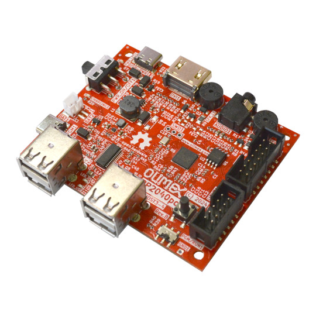

# RP2040pc
All in one computer with 4 USB hosts, Stereo Audio, HDMI output. Supports USB Flash drives, USB keyboards, USB Gamepads.

https://www.olimex.com/Products/RaspberryPi/RP2040pc/

## Licensee
* Hardware is released under CERN Open Hardware Licence Version 2 - Strongly Reciprocal
* Software is released under MIT Licensee
* Documentation is released under CC BY-SA 4.0